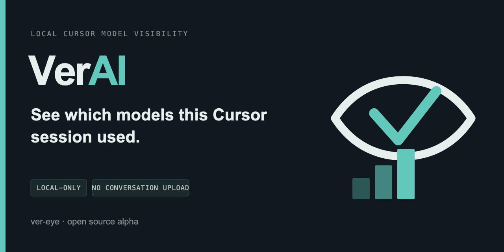

<p align="center">
  
</p>

<p align="center">
  
</p>

# VerAI

> **VerAI（读 ver-eye）**：本地看清 Cursor 这次会话主要用了哪些模型。不上传对话正文。

同一仓库也保留 AI 渠道验真能力：以**被动监控为主、主动探测为辅**，检测中转站偷换模型、质量下滑与官方模型降智。

仓库：<https://github.com/black-pupil153/VerAI> · 侧边栏软发布：[v0.1.0-sidebar](https://github.com/black-pupil153/VerAI/releases/tag/v0.1.0-sidebar)

## 核心能力

| 能力 | 说明 |
|------|------|
| 渠道验真 | `check` / `score`：指纹、质量题、反侦测探针，给当前渠道打分 |
| 透明代理 | 拦截真实流量（含 SSE），旁路落库 + 异常报警 |
| 多模型渠道 | OpenAI / Anthropic / GLM（智谱）及 OpenAI 兼容中转 |
| CC Switch | 自动读当前供应商；`ai-verify run -- claude` 一键包装 |
| 定时巡检与周报 | `monitor` / `history` / `report` |
| Cursor Auto Usage | 只读本机 Cursor 遥测；任务级事实/推断分轨与 coverage（推断≠云端真值） |

## 安装

```bash
cd ai-verify
python -m venv venv
source venv/bin/activate
pip install -e ".[dev]"
```

可选 ML 指纹（重依赖）：`pip install -e ".[ml]"`

## 快速开始：渠道验真

### 1. 单元测试（不耗 API）

```bash
pytest -q tests -k "not ml_optional"
```

### 2. 配置渠道

```bash
ai-verify config init
ai-verify config set base_url https://你的中转或官方/v1
ai-verify config set api_key sk-xxx
ai-verify config set model claude-sonnet-4.6   # 或 gpt-4o / glm-4.6
ai-verify config list
```

GLM 官方示例：

```bash
ai-verify config set base_url https://open.bigmodel.cn/api/paas/v4
ai-verify config set api_key 你的智谱key
ai-verify config set model glm-4.6
```

### 3. 主动验证与打分

```bash
ai-verify check
ai-verify check --full --probes 8 --questions 10
ai-verify score
ai-verify score --board
ai-verify score --watch --interval 30m
```

## Claude Code + CC Switch

```bash
ai-verify providers list
ai-verify providers current
ai-verify run -- claude
ai-verify check
ai-verify score
```

代理日志：`~/.ai-verify/logs/proxy.log`  
调用记录：`ai-verify history --last 1d`

```bash
ai-verify monitor start --interval 6h
ai-verify report --period weekly
ai-verify alert set https://你的飞书或钉钉webhook
ai-verify alert test
```

## Cursor 侧边栏（软发布）

看清**这个会话主要用了哪些模型**（本地计算，不上传对话正文）。产品默认读统一构成 `model_mix_v2`；确认/估算拆分只在折叠细则与 CLI `--verbose`。

### 1. 安装 CLI

```bash
cd ai-verify
python -m venv venv
source venv/bin/activate
pip install -e .
ai-verify cursor doctor
```

### 2. 安装扩展（Install from VSIX）

1. 从 [GitHub Releases](https://github.com/black-pupil153/VerAI/releases) 下载 `verai-cursor-0.1.0.vsix`  
   （或本机构建：`cd extensions/verai-cursor && npm run package`）
2. Cursor → Extensions → `⋯` → **Install from VSIX…** → 选中文件 → Reload
3. Activity Bar 打开 **VerAI**；无数据时先：

```bash
ai-verify cursor import --since 7d
```

可选（提高事实覆盖）：`ai-verify cursor hooks install`，然后新开/继续会话再 Refresh。

CLI 找不到时：Settings 搜索 `VerAI: AI Verify Path`，填入 `ai-verify` 绝对路径。  
扩展说明与故障排查：[`extensions/verai-cursor/README.md`](extensions/verai-cursor/README.md)

### 3. CLI 对照

```bash
ai-verify cursor doctor
ai-verify cursor tasks --limit 5
ai-verify cursor task --latest          # 默认统一构成
ai-verify cursor task --latest -v       # 分轨细则
ai-verify cursor task --latest --json   # 插件契约（含 model_mix_v2）
```

只读本机元数据（不读 prompt/response 正文）。推断 ≠ Cursor 官方逐步真名，且不得写入 `resolved_model`。  
设计细节：[`docs/CURSOR_AUTO_USAGE.md`](docs/CURSOR_AUTO_USAGE.md) · 路线图：[`docs/ROADMAP.md`](docs/ROADMAP.md)

## 配置与数据

`~/.ai-verify/config.yaml`，数据在 `~/.ai-verify/data/ai_verify.db`。

## 开发

```bash
pip install -e ".[dev]"
pytest -q tests -k "not ml_optional"
black ai_verify/
ruff check ai_verify/
python -m build
```

文件职责索引：[`docs/FILE_INVENTORY.md`](docs/FILE_INVENTORY.md)  
阶段交接：[`docs/PROJECT_STATUS.md`](docs/PROJECT_STATUS.md)  
产品路线图：[`docs/ROADMAP.md`](docs/ROADMAP.md)

## License

MIT
