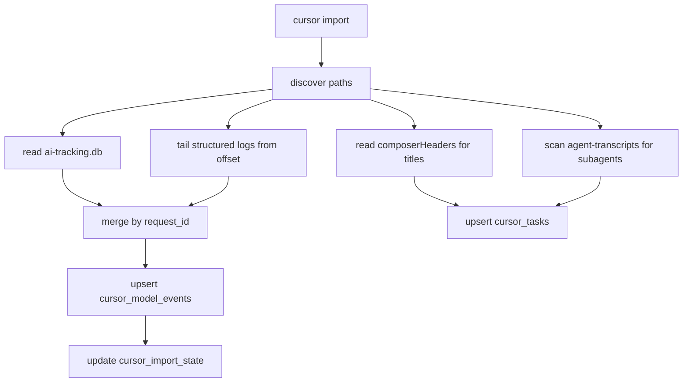

# Cursor Auto Usage — 设计与验收

> 版本：v1.2  
> 日期：2026-07-19  
> 状态：**已实现并完成本机验收**（P0–P2.5 代码与测试已落地；A3.1 `model_mix_v2` 产品契约已接入）  
> 适用范围：设计依据 + 维护说明；**不要**按旧「从零实现」清单重做功能

权威交接与下一阶段优先级见 [`PROJECT_STATUS.md`](PROJECT_STATUS.md) / [`ROADMAP.md`](ROADMAP.md)。

**产品默认视图（2026-07-19）**：对外展示优先消费 `model_mix_v2`（统一调用次数构成；根任务 + 一层子代理）。`factual_*` / `inferred_*` / `coverage` 仍输出，供 CLI `--verbose` 与兼容消费者；推断仍不得写入 `resolved_model`。

---

## 0. 规划合并说明

本文整合了两份规划的共识，并补齐了原先遗漏的点：

| 议题 | 原规划 A | Codex 规划 | 本文定稿 |
|------|----------|------------|----------|
| 模块边界 | `integrations/cursor/` | `providers/cursor.py` + `monitor/cursor_usage.py` | **独立 Cursor Auto Usage 模块**，与 cc-switch **并列**，不进入 `resolve_provider()` |
| 导入命令 | `cursor sync` | `cursor import` | **`cursor import`**（语义更准确：只读本地元数据） |
| 增量导入 | 未明确 | `cursor_import_state` | **必须有**，避免每次全量扫日志 |
| 置信度 | 有概念 | 有规则表 | **每条 event 带 confidence + event_source** |
| Subagent | 提到但未建模 | 未提 | **`parent_task_id` + transcript 目录关联** |
| Hook 补采 | Phase 2 | 未提 | **P2.5 可选**，不阻塞 MVP |
| 代理路径 | 未强调 | 补充证据源 | **仅作补充**，不进 MVP |
| 隐私 | 提过 | 未写清 | **只读元数据，不读 prompt/response 正文** |
| `doctor` | 无 | P0 | **MVP 第一步** |

---

## 1. 产品定位

### 1.1 一句话

**Cursor Auto Usage** — 只读 Cursor 本地遥测，回答「这个 Agent 任务里 Auto 实际路由到了哪些模型、各占多少」。

### 1.2 与现有能力的关系

```
verkeep-verify
├── CC Switch 质量测评     ← 已有：测中转源真假/质量
├── Proxy 被动监控         ← 已有：拦截 OpenAI/Anthropic 兼容 API
└── Cursor Auto Usage      ← 新增：透视 Cursor 内置路由（独立模块）
```

**禁止**：把 Cursor 路径探测塞进 `providers/cc_switch.py` 的 `resolve_provider()`。  
**允许**：在 `report.py` 周报里增加 Cursor 章节（P2）。

### 1.3 官方限制（产品文案必须写清）

Cursor 官方说明 Auto 会平衡智能、成本、可靠性；usage pool 可在设置和 [Cursor usage dashboard](https://cursor.com/docs/models-and-pricing) 查看，但**未公开承诺**每个任务最终用了哪个底层模型。

因此本功能输出必须带 **置信度标签**，推断不等于事实。

---

## 2. 功能定义

### 2.1 核心问题

```text
这个 Cursor 任务里，Auto/Agent 实际用了哪些模型？
按请求数、代码产出、失败/取消次数分别占多少？
```

### 2.2 实体定义

| 概念 | 字段 | 说明 |
|------|------|------|
| 任务 (Task) | `conversationId` / `composerId` | 一个 Agent 会话；两者在日志中互通，统一存为 `task_id` |
| 请求 (Turn) | `requestId` | 一次 submit/stream；关联多源证据的主键 |
| Subagent | `subagents/<agentId>.jsonl` | 独立 `composerId`，通过 `parent_task_id` 挂到父任务 |
| Auto 路由 | `model_intent == "default"` 或 `modelName == "default"` | `route_kind = auto` |
| 选定模型 | `selected_model` | 用户/UI 层选择的模型（含 default） |
| 解析模型 | `resolved_model` | 实际执行模型（高置信度时才填） |

### 2.3 核心指标

| 指标 | MVP (P0+P1) | 说明 |
|------|:-----------:|------|
| 请求占比 | ✅ | 每 task 下各模型 `request_id` 去重计数 |
| 代码产出占比 | ✅ | `ai_code_hashes` 按 model 计数（近似产出量） |
| 模式占比 | ✅ | agent / plan / ask（来自 `unifiedMode` / `mode`） |
| 成功/取消/错误占比 | ✅ | structured log 的 `outcome` |
| Subagent 模型分布 | ✅ | 父子任务分别统计 + 汇总 |
| Token / 费用占比 | ⏳ P4 | 本地不一定有；字段预留，显示 `unknown` |
| 模型质量关联 | ⏳ P3 | 对接 `score_snapshots` + `VerifyEngine` |

---

## 3. 数据源设计

### 3.1 证据源优先级

```
P0  ai-tracking.db          → 代码产出模型（high）
P0  structured logs         → 请求路由、outcome、mode（medium-high）
P1  renderer.log            → buildRequestedModel 补充 catalogModelId
P1  composer.composerHeaders → 任务标题、archived 状态
P1  agent-transcripts        → subagent 父子关系（无 model，仅结构）
P2  proxy/api_calls          → 仅 BYOK/兼容 API 场景（high，非 Cursor 主路径）
P2.5 Cursor Hooks            → 补全无写码 turn 的 model（待验证 stdin 字段）
```

### 3.2 证据源 A：`~/.cursor/ai-tracking/ai-code-tracking.db`

**用途**：代码产出占比（最可靠的 `resolved_model` 来源）

已知 schema（实施时用 `doctor` 再验证）：

```sql
ai_code_hashes (
  hash, source, fileExtension, fileName,
  requestId, conversationId, timestamp, model, createdAt
)
conversation_summaries (
  conversationId, title, tldr, overview, summaryBullets,
  model, mode, updatedAt
)
tracked_file_content (gitPath, content, conversationId, model, ...)
ai_deleted_files (gitPath, composerId, conversationId, model, deletedAt, ...)
```

**读取策略**：

- 以 `conversationId + requestId + model` 聚合 `COUNT(*)`
- **不读** `content`、`tldr`、`overview` 等正文
- DB 被锁时：尝试 `sqlite3 URI mode=ro` 或复制到 temp 再读

**本机实测参考**（任务 `906dea0f`）：

| model | hashes |
|-------|--------|
| claude-fable-5 | 1494 |
| grok-4.5 | 834 |

### 3.3 证据源 B：Cursor Structured Logs

**路径模式**（macOS）：

```text
~/Library/Application Support/Cursor/logs/**/exthost/anysphere.cursor-always-local/Cursor Structured Logs*.log
~/Library/Application Support/Cursor/logs/**/renderer.log
```

**关键 JSON 事件**（每行一个 JSON，`message` 字段区分类型）：

| message | 提取字段 |
|---------|----------|
| `Composer state loaded` | `composerId`, `modelName`, `unifiedMode`, `requestId` |
| `Starting stream request` | 同上 + `conversationLength` |
| `agent.turn.outcome` | `model_intent`, `conversation_id`, `request_id`, `outcome`, `ttft_ms`, `error_text` |
| `[buildRequestedModel]` (renderer) | `composerId`, `catalogModelId`, `composerModelName`, `selectedModelIds` |

**增量导入**：`cursor_import_state` 记录每个 log 文件的 `last_offset`（字节偏移），`import` 时 seek 续读。

**日志轮转**：新 session 目录出现时 `doctor` 重新发现；旧文件 offset 失效时从头扫并 dedupe。

### 3.4 证据源 C：`composer.composerHeaders`

**路径**：`~/Library/Application Support/Cursor/User/globalStorage/state.vscdb`  
**Key**：`composer.composerHeaders`  
**用途**：补任务 `title`（`subtitle` 字段）、`unifiedMode`、`numSubComposers`

### 3.5 证据源 D：Agent Transcripts

**路径**：`~/.cursor/projects/<project-slug>/agent-transcripts/<composerId>/`

- 主会话：`<composerId>.jsonl`
- Subagent：`subagents/<subagentId>.jsonl`

**用途**：构建 `parent_task_id`（Task tool 触发的 subagent 目录在父 composerId 下）  
**不用途**：提取 model（jsonl 无 model 字段）

### 3.6 证据源 E：Proxy（补充，非 MVP）

`proxy/server.py` 已能解析响应 `model` + `usage`。  
Cursor first-party 云请求**不走本地代理**，仅在用户 BYOK / 自定义 endpoint 时有效。  
P2 可将 `api_calls` 中 `source=cursor_proxy` 的事件 merge 进来。

---

## 4. 置信度与合并规则

### 4.1 置信度表

| 证据 | confidence | 写入字段 |
|------|------------|----------|
| `ai_code_hashes.model` + requestId + conversationId 对齐 | **high** | `resolved_model` |
| structured log `catalogModelId` / 非 default 的 `modelName` | **medium-high** | `resolved_model`（若 intent=default 且 name≠default 则用 name） |
| structured log `model_intent=default` 且无 tracking 记录 | **low** | `resolved_model=NULL`, `route_kind=auto` |
| proxy 响应 model + usage | **high** | 仅 BYOK 场景 |
| 指纹/延迟推断 | **low** | **禁止**参与占比计算，仅 UI 提示 |

### 4.2 单条 event 合并算法

```python
def merge_turn(request_id, task_id, sources):
    selected = first(sources, "selected_model")  # log modelName / model_intent
    route_kind = "auto" if selected in ("default", None) else "specific"

    resolved = None
    confidence = "low"
    event_source = "structured_log"

    if tracking := sources.get("ai_tracking"):
        resolved = tracking.model
        confidence = "high"
        event_source = "ai_tracking_db"
    elif log_model := sources.get("catalog_model_id"):
        if log_model != "default":
            resolved = log_model
            confidence = "medium-high"
            event_source = "structured_log"
    elif selected and selected != "default":
        resolved = selected
        confidence = "medium"
        event_source = "structured_log"

    return CursorModelEvent(
        selected_model=selected,
        resolved_model=resolved,
        route_kind=route_kind,
        confidence=confidence,
        event_source=event_source,
        ...
    )
```

### 4.3 占比计算

同一 task 下：

```text
请求占比(model X) = count(distinct request_id where resolved_model=X or selected_model=X)
                  / count(distinct request_id)

产出占比(model X) = count(ai_code_hashes where model=X)
                  / count(ai_code_hashes)
```

**展示规则**：

- 同时展示「请求占比」和「产出占比」（两者可能不一致，这正是用户想看的）
- `resolved_model` 为 NULL 的 turn 单独计入 `unknown`，不强行分配

---

## 5. 模块与文件结构

```
verkeep_verify/
├── providers/
│   └── cursor.py              # 路径探测、schema 探测、平台适配（只读）
├── monitor/
│   └── cursor_usage.py        # 导入编排、聚合、统计查询
├── cursor_logs.py             # structured log + renderer.log 解析器
├── dashboard_cursor.py        # Rich 看板（P2）
├── storage/
│   └── database.py            # 新增 cursor_* 表 + CRUD
├── cli.py                     # 新增 cursor 命令组
└── report.py                  # P2：周报增加 Cursor 章节
```

**不放** `integrations/cursor/`（避免与 cc-switch provider 概念混淆）。

### 5.1 `providers/cursor.py` 职责

```python
@dataclass
class CursorPaths:
    ai_tracking_db: Path | None
    global_state_db: Path | None
    logs_dir: Path | None
    projects_dir: Path | None

def discover_cursor_paths() -> CursorPaths: ...
def probe_ai_tracking_schema(db: Path) -> dict: ...   # 表/列存在性
def probe_structured_logs(logs_dir: Path) -> list[Path]: ...
```

平台路径：

| 平台 | ai-tracking | logs | globalStorage |
|------|-------------|------|---------------|
| macOS | `~/.cursor/ai-tracking/ai-code-tracking.db` | `~/Library/Application Support/Cursor/logs/` | `.../User/globalStorage/state.vscdb` |
| Linux | 同左 | `~/.config/Cursor/logs/` | `~/.config/Cursor/User/globalStorage/state.vscdb` |
| Windows | 同左 | `%APPDATA%/Cursor/logs/` | `%APPDATA%/Cursor/User/globalStorage/state.vscdb` |

### 5.2 `cursor_logs.py` 职责

- 流式读 log，正则/JSON 提取事件
- 输出统一 `LogEvent` dataclass
- 处理日志前缀：`2026-07-09 20:27:19.991 [info] {json}`

### 5.3 `monitor/cursor_usage.py` 职责

- `import_all(since: timedelta) -> ImportResult`
- `aggregate_task(task_id) -> TaskUsageReport`
- `list_tasks(since, limit) -> list[TaskSummary]`
- dedupe：`(task_id, request_id, event_source, timestamp)` 唯一

---

## 6. 数据库设计

在 `database.py` 的 `_ensure_tables()` 追加：

```sql
CREATE TABLE IF NOT EXISTS cursor_tasks (
    task_id TEXT PRIMARY KEY,
    project_path TEXT,
    title TEXT,
    mode TEXT,                    -- agent | plan | ask | unknown
    route_kind TEXT,              -- auto | specific | mixed | unknown
    started_at DATETIME,
    ended_at DATETIME,
    request_count INTEGER DEFAULT 0,
    code_unit_count INTEGER DEFAULT 0,
    subagent_count INTEGER DEFAULT 0,
    source TEXT DEFAULT 'import'  -- import | hook
);

CREATE TABLE IF NOT EXISTS cursor_model_events (
    id TEXT PRIMARY KEY,          -- uuid
    task_id TEXT NOT NULL,
    parent_task_id TEXT,          -- subagent 父任务
    request_id TEXT,
    selected_model TEXT,
    resolved_model TEXT,
    route_kind TEXT,              -- auto | specific | unknown
    event_source TEXT,            -- ai_tracking_db | structured_log | renderer_log | proxy | hook
    confidence TEXT,              -- high | medium-high | medium | low
    generated_units INTEGER DEFAULT 0,
    input_tokens INTEGER,         -- nullable
    output_tokens INTEGER,        -- nullable
    latency_ms INTEGER,
    ttft_ms INTEGER,
    status TEXT,                  -- success | error | cancelled | unknown
    error_text TEXT,
    timestamp DATETIME,
    UNIQUE(task_id, request_id, event_source, timestamp)
);

CREATE INDEX IF NOT EXISTS idx_cursor_events_task ON cursor_model_events(task_id);
CREATE INDEX IF NOT EXISTS idx_cursor_events_request ON cursor_model_events(request_id);
CREATE INDEX IF NOT EXISTS idx_cursor_events_model ON cursor_model_events(resolved_model);
CREATE INDEX IF NOT EXISTS idx_cursor_tasks_started ON cursor_tasks(started_at);

CREATE TABLE IF NOT EXISTS cursor_import_state (
    source_path TEXT PRIMARY KEY,
    last_offset INTEGER DEFAULT 0,
    last_inode TEXT,              -- 文件轮转检测
    last_seen_at DATETIME
);
```

**聚合缓存**（可选，P2 再加 `cursor_model_usage` 物化表；MVP 直接 SQL 聚合即可）。

---

## 7. CLI 设计

在 `cli.py` 新增命令组，风格对齐现有 `providers` / `monitor`：

```bash
# P0：环境探测
verkeep-verify cursor doctor

# P1：导入
verkeep-verify cursor import [--since 7d] [--full]

# P1：列表
verkeep-verify cursor tasks [--since 7d] [--limit 20] [--auto-only]

# P1：单任务详情（核心）
verkeep-verify cursor task <task_id>
verkeep-verify cursor task --latest
verkeep-verify cursor task --search "verkeep-verify"

# P2：看板
verkeep-verify cursor board [--watch]

# P2：周报
verkeep-verify cursor report --period weekly

# P3：质量关联
verkeep-verify cursor task <task_id> --score
```

### 7.1 `cursor doctor` 输出示例

```text
Cursor Auto Usage — 环境诊断

✓ ai-tracking.db     ~/.cursor/ai-tracking/ai-code-tracking.db (1.3 MB)
  schema: ai_code_hashes ✓  conversation_summaries ✓
✓ structured logs    12 files, latest 2026-07-09
✓ global state       composer.composerHeaders ✓
✓ agent transcripts  ~/.cursor/projects/Users-gelion-code-alibaba/agent-transcripts (8 tasks)
✗ proxy supplement   0 cursor-related api_calls

可采集字段:
  resolved_model (high)    via ai_code_hashes.model
  request routing (med)    via structured logs
  outcome/ttft (med)       via agent.turn.outcome
  tokens (unknown)         not found in local logs

建议: verkeep-verify cursor import --since 7d
```

### 7.2 `cursor tasks` 输出示例

```text
Cursor Auto Usage — 最近 7d

任务ID      标题                          模式   路由   请求  产出   模型占比(请求)
906dea0f    审阅项目并规划产品路径         agent  mixed  4     2328   claude-fable-5 25% / grok-4.5 75%
619b7ecc    (无标题)                       agent  spec   2     0      grok-4.5 100%  [cancelled×2]
166af1e3    规划 Cursor Auto 探测功能      agent  auto   3     0      unknown 100%
```

### 7.3 `cursor task` 详情输出示例

```text
Task 906dea0f-be35-471a-a97e-df528b6b9090
标题:   审阅项目并规划产品路径
模式:   agent | 路由: mixed (先 specific 后 auto)
时间:   2026-07-03 10:11 ~ 18:17 (约 8h)
请求:   4 turns | 产出: 2328 code units | Subagent: 1

── 请求占比 ──────────────────────────
  grok-4.5          ████████████████░░░░  75%  (3 requests)
  claude-fable-5    █████░░░░░░░░░░░░░░░  25%  (1 request)

── 产出占比 ──────────────────────────
  claude-fable-5    █████████████░░░░░░░  64.2%  (1494 units)
  grok-4.5          ███████░░░░░░░░░░░░░  35.8%  (834 units)

── 状态分布 ──────────────────────────
  success: 3 | cancelled: 1 | error: 0

── 证据质量 ──────────────────────────
  high (ai_tracking_db):     4/4 requests with resolved_model
  medium (structured_log):   4/4 with selected_model

── Subagent ─────────────────────────
  69bcc245 (explore)  → 1 request, model unknown (no code output)

── Per-request 明细 ──────────────────
  request_id          selected    resolved         status     units
  c1562b95-...        claude-f5   claude-fable-5   success    1494
  f10675fa-...        grok-4.5    grok-4.5         success    141
  d3a99a5e-...        grok-4.5    grok-4.5         success    251
  e6b739d5-...        grok-4.5    grok-4.5         cancelled  442
```

---

## 8. 实施阶段

### P0：`cursor doctor`（0.5 天）— **已完成**

**交付**：

- [x] `providers/cursor.py`：路径发现 + schema 探测
- [x] `cli.py`：`cursor doctor`
- [x] 测试：`tests/test_cursor_paths.py`（mock 路径）

**验收**：在本机跑出 doctor 输出（见 §8.5）。

---

### P1：离线导入 + 报表（2–3 天）— **MVP 已完成**

**交付**：

| 文件 | 内容 |
|------|------|
| `cursor_logs.py` | 解析 Structured Logs + renderer.log |
| `monitor/cursor_usage.py` | 导入编排、dedupe、聚合 |
| `storage/database.py` | 三表 + `save_cursor_*` / `query_cursor_*` |
| `cli.py` | `import` / `tasks` / `task` |

**导入流程**：



**测试**：

- [x] `tests/fixtures/cursor/structured_log_sample.log`
- [x] `tests/fixtures/cursor/create_ai_tracking_sample.py`（最小 schema）
- [x] `tests/fixtures/cursor/hook_subagent_malformed.ndjson`（脱敏 hook 夹具）
- [x] `tests/test_cursor_logs.py`
- [x] `tests/test_cursor_usage.py`：聚合逻辑、置信度、dedupe、hook 清洗

**验收**：

```bash
verkeep-verify cursor doctor
verkeep-verify cursor import --since 7d
verkeep-verify cursor task 906dea0f-be35-471a-a97e-df528b6b9090
# 产出占比应接近 claude-fable-5 64% / grok-4.5 36%
```

---

### P2：看板 + 周报（1–2 天）— **已完成**

**交付**：

- [x] `dashboard_cursor.py`：`cursor board [--watch]`
- [x] `report.py`：增加 Cursor 章节
- [x] `cli.py`：`cursor report --period weekly`

复用 `dashboard.py` 的 Rich Table / sparkline 风格。

---

### P2.5：Cursor Hook 补采（可选，1 天）— **已完成**

**触发**：P1 完成后，若 `unknown` 占比过高再实施。

在 `~/.cursor/hooks.json`：

```json
{
  "version": 1,
  "hooks": {
    "afterAgentResponse": [{ "command": "~/.verkeep/verify/hooks/cursor-track.sh" }],
    "subagentStop": [{ "command": "~/.verkeep/verify/hooks/cursor-track.sh" }]
  }
}
```

Hook 脚本 append 到 `~/.verkeep/verify/cursor-hook-probe.ndjson`，`import` 时作为 `event_source=hook` 合并。  
**本机已验证**：hook stdin 含 `model` / `model_id` / `subagent_model`；`subagent_id` 偶发带引号与嵌入换行，导入侧用 `normalize_cursor_id` 清洗，且子任务不进入顶层 `cursor tasks` 列表。

---

### P3：质量关联（1–2 天）— **部分完成**

```bash
verkeep-verify cursor task <id> --score
```

对该 task 出现过的 `resolved_model` 列表：

1. 查 `score_snapshots` 最近分数
2. 无记录则调 `VerifyEngine.verify(quick=True)` 补测
3. 输出：模型占比 + 智力分 + 偏差

CLI `--score` 与 `get_model_scores()` 已有；完整 VerifyEngine 按模型补测仍可按需加深。

---

### P4：Token / 费用（按需）— **未做**

- 扫描 logs 是否新增 token 字段
- 有则填入 `input_tokens` / `output_tokens`
- 无则 UI 显示 `—`，**不估算**

本机 doctor 仍报告 `tokens (unknown)`。

---

### 8.5 本机验收结果（2026-07-11）

| 项 | 结果 |
|----|------|
| Cursor 版本 | 3.10.20 |
| doctor | ai-tracking ✓、structured logs 66 files ✓、composerHeaders 82 ✓、transcripts ✓ |
| import `--since 30d --full` | 任务/事件可导入；hook 10 条中 resolved 6 |
| 任务 `906dea0f` 产出占比 | claude-fable-5 **64.2%** / grok-4.5 **35.8%**（符合设计验收） |
| Auto 任务 | 无事实 → `pending-infer`（待盲测覆盖）；报表分轨 `factual_*` / `inferred_*` + `coverage`；保留 confidence / unknown |
| 标题 | 读 `composerHeaders` **表** + 旧 ItemTable JSON；优先自动生成 `name`，再 `title`/`subtitle`；不读 prompt 补标题 |
| 回归 | `pytest -q tests -k "not ml_optional"` → **110 passed** |

---

## 9. 测试计划

```bash
# 单元测试
pytest tests/test_cursor_paths.py tests/test_cursor_logs.py tests/test_cursor_usage.py -v

# 本机集成验证
verkeep-verify cursor doctor
verkeep-verify cursor import --since 30d
verkeep-verify cursor tasks --limit 5
verkeep-verify cursor task --latest
```

**回归**：确保现有 `pytest` 全绿，不破坏 cc-switch / proxy 测试。

---

## 10. 风险与约束

| 风险 | 应对 |
|------|------|
| Cursor 日志格式变更 | `doctor` 版本探测；解析器宽松 JSON；fixture 测试 |
| ai-tracking.db 锁 | 只读 URI / 临时复制 |
| Auto 路由不透明 | 置信度 + unknown 桶；不宣称 100% 准确 |
| 隐私 | 只存 task_id / model / 计数 / outcome；不存 prompt |
| 日志轮转丢历史 | `--full` 全量重导；文档说明保留期 |
| Windows 路径 | `providers/cursor.py` 三平台表 |

---

## 11. 维护清单（本机验证 + 修 bug）

按顺序执行；**不要**从零重建 P0/P1 模块：

```
1. verkeep-verify cursor doctor
2. verkeep-verify cursor import --since 30d [--full]
3. verkeep-verify cursor tasks --limit 5
4. verkeep-verify cursor task --latest
5. 对照已知任务（如 906dea0f）检查产出占比
6. 若解析/合并异常：修 providers/cursor.py / cursor_logs.py / cursor_usage.py
7. 补脱敏夹具 + pytest；回归：pytest -q tests -k "not ml_optional"
8. 更新本节验收表与 PROJECT_STATUS.md
```

**MVP 完成定义（已满足）**：`doctor` + `import` + `tasks` + `task` 可用，本机任务 `906dea0f` 双模型产出占比正确。

---

## 12. 与 cc-switch 测评的协同叙事（产品层）

```text
cc-switch 测评  →  「我买的这个中转源靠谱吗？」
Cursor Auto     →  「Cursor 背着我用了哪些模型？值不值？」
两者结合        →  「Auto 大量路由到低端模型时，是否需要换源或改用手选模型？」
```

---

## 13. 新会话开场模板

```text
先阅读 docs/PROJECT_STATUS.md、README.md 和 docs/CURSOR_AUTO_USAGE.md。
不要重做 Cursor P0/P1：代码和测试已经存在。
先在本机运行 verkeep-verify cursor doctor、cursor import --since 30d、cursor tasks --limit 5、cursor task --latest，
根据真实输出补齐问题、测试与文档；保持 confidence/unknown 和隐私边界。
回归使用：venv/bin/python -m pytest -q tests -k "not ml_optional"。
```
