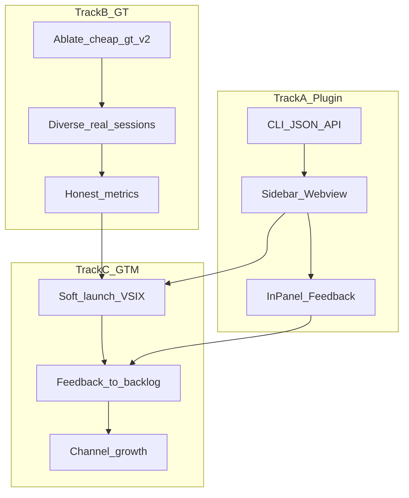

# VerAI 产品化与增长路线图

> 更新日期：2026-07-13  
> 决策锁定：插件形态 **1A**（侧边栏 Webview）· 带宽 **2B**（插件 MVP ∥ GT/盲测加固）

## 一句话目标

把「CLI 里能算清会话模型占比」做成 **Cursor 侧边栏每天能点开看** 的产品，同时把盲测从脆弱小样本推成可汇报区间；用本地优先 + 反馈驱动做软发布与增长。

## 决策（已锁定）

| 项 | 选择 | 说明 |
|----|------|------|
| 插件形态 | Cursor/VS Code **侧边栏 Webview** | 公开 API 不支持 Composer 会话内嵌 Tab；侧边栏是可交付替代 |
| 带宽 | 4–6 周 **并行** | Track A（插件）与 Track B（GT）约各一半 |
| 数据原则 | 不变 | 事实/推断分轨；推断不写 `resolved_model`；本地优先、正文不上传 |

## 现状可复用资产

- 单任务占比：`aggregate_task` → `factual_*` / `inferred_*` / `coverage` / `output_shares`
- CLI：`cursor task` / `tasks` / `board` / `hooks`；已补 `doctor|tasks|task --json`
- 盲评：`cheap-gt-v3` Acc@forced **53.1%**（n=32）；`cheap-gt-v2` 曾 **78.6%**（n=14，短会话）
- 通道消融（同 split）：见 `PROJECT_STATUS.md`；**+latency** 抬升明显

## 双轨总览



---

## Track A — Cursor 侧边栏插件 MVP

### A0. 定位文案

> VerAI：看清**这个会话**里各模型实际占比（事实 vs 推断），本地计算、不上传对话正文。

### A1. 仓库结构

[`extensions/verai-cursor/`](../extensions/verai-cursor/)（VS Code extension，兼容 Cursor）：

- Activity Bar + `verai.sessionView` WebviewViewProvider
- `bridge` 调本机 `ai-verify … --json`
- 面板：会话选择器 + 事实/推断占比 + coverage

首版 **100% 本地**，无云端账号。

### A2. 后端契约（CLI `--json`）

| 命令 | 用途 | 状态 |
|------|------|------|
| `ai-verify cursor doctor --json` | 插件首屏健康检查 | ✅ |
| `ai-verify cursor tasks --json --limit N` | 最近会话列表 | ✅ |
| `ai-verify cursor task [--latest\|id] --json` | 单会话报告 | ✅ |
| 插件内静默 `cursor import --since 1d` | 刷新数据 | 待接扩展 |

### A3. 面板 UX

1. 会话选择器（最近 N；默认 latest；手动刷新）
2. 模型占比堆叠条 + 表（事实 / 推断分轨；`pending-infer` 标注）
3. 可信度一行：`coverage` +「推断≠官方真名」

### A4. 安装路径（软发布）

1. `vsce package` → `.vsix`，文档写 Install from VSIX
2. 依赖本机 `ai-verify` 在 PATH；doctor 失败给修复步骤
3. 可选提示 `cursor hooks install`

**验收**：侧边栏打开 → 选最近会话 → 10 秒内看到占比，与 CLI 数字一致。

---

## Track B — GT / 盲测加固

| 项 | 动作 | 成功标准 | 状态 |
|----|------|----------|------|
| B1 | `ablate` on `cheap-gt-v2` | 明确各通道贡献 | ✅（见 PROJECT_STATUS） |
| B2 | 每便宜类再补 ≥5 真实长会话 | test 每类 ≥3 会话；n_test ≥30 | ✅ `cheap-gt-v3`（见 PROJECT_STATUS） |
| B3 | 专治 sol↔terra / fable→composer | 近亲混淆下降 | 待做 |
| B4 | `eval-auto` 扩量；面板与 CLI 对齐 | 指标写回 PROJECT_STATUS | 部分（limit=20 已记） |
| B5 | 对外只报 forced/selective + n | 勿混 LOCO-CV | 纪律已立 |

微调 / sentence-transformers：**后置**到隐藏 test 平台期。

---

## Track C — 发布与增长（本地工具型）

```text
Repo 星标 → VSIX 软发布 → 活跃侧边栏用户 → 反馈议题 → 周迭代 → 公开 v0.1 → 社区扩散
```

1. **Dogfood（本周）**：自己每天用面板；修 doctor/PATH/空数据
2. **Closed alpha（5–15 人）**：Cursor 重度用户；「是否看懂占比 / 是否信任推断」
3. **Public soft launch**：GitHub Release + VSIX + 一页 README
4. **Growth**：Cursor Forum → X → Reddit r/cursor → 即刻/V2EX → Product Hunt（稳定后再上）

反馈：面板底部极轻本地 `~/.ai-verify/feedback.jsonl`（默认不上报）；每周选 1–2 项进下一版。

增长指标：doctor 绿、侧边栏周活、coverage 分布、「不准」反馈占比、GitHub 星标。  
暂缓：付费、SaaS、团队云看板。

---

## 4–6 周节奏

| 周 | Track A | Track B | Track C |
|----|---------|---------|---------|
| 1 | CLI `--json` + 扩展骨架 | `ablate` cheap-gt-v2 | Dogfood；本路线图 |
| 2 | 会话列表+占比 UI | 真实长会话扩量 | 招募 5 人 alpha |
| 3 | 刷新/静默 import；反馈按钮 | n_test 冲 30；近亲混淆 | Alpha 问卷 |
| 4 | VSIX + 安装文档 | eval-auto 扩量 | Soft launch |
| 5–6 | 按反馈修 UX | 平台期判断是否 Phase 3 | 渠道扩散 |

## 明确不做（本阶段）

- Composer 内真实 Tab（无公开 API）
- 云端账号 / 上传正文
- Auto 自标当训练 GT
- 强行扩 fable 凑 10
- 微调分类器（未到平台期）

## 首个可交付里程碑（约 2 周）

1. `extensions/verai-cursor` 可装 VSIX：侧边栏显示 latest 会话模型占比
2. `cursor doctor|tasks|task --json` 稳定（✅ 本周起步）
3. `ablate` 结论写入 PROJECT_STATUS（✅）
4. 5 人 alpha 名单与反馈表就绪
