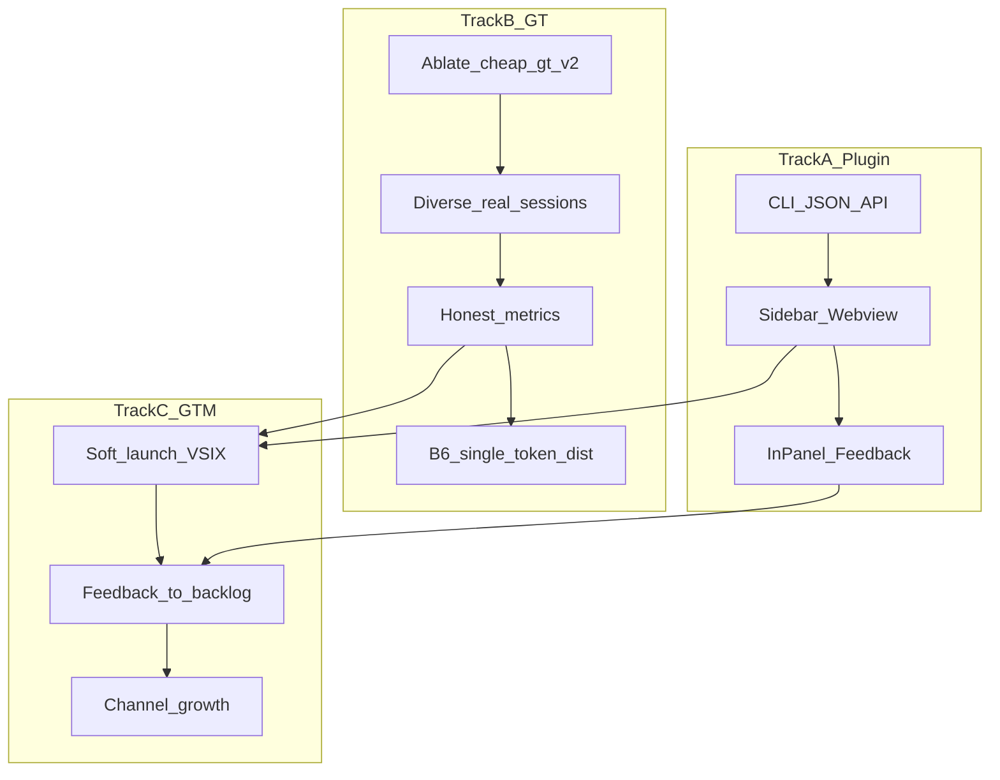

# VerAI 产品化与增长路线图

> 更新日期：2026-07-21  
> 决策锁定：插件形态 **1A**（侧边栏 Webview）· 主线 **A4 软发布 → closed alpha**；Track B 反馈触发（含 B6 单 token 分布特征）

## 一句话目标

把「CLI 里能算清会话模型占比」做成 **Cursor 侧边栏每天能点开看** 的产品；默认只回答「这次会话主要用了哪些模型」。盲测/GT 改为反馈触发的后台能力。

## 决策（已锁定）

| 项 | 选择 | 说明 |
|----|------|------|
| 插件形态 | Cursor/VS Code **侧边栏 Webview** | 公开 API 不支持 Composer 会话内嵌 Tab；侧边栏是可交付替代 |
| 产品主视图 | **统一调用次数构成** | 确认/估算仅进折叠细则；产出权重退出主视图 |
| 会话范围 | 根任务 + **一层子代理** | 列表 `request_count` 与详情同口径 |
| 数据原则 | 不变 | 推断不写 `resolved_model`；本地优先、正文不上传；JSON 保留旧分轨字段 |
| Track B | **反馈触发** | 仅当 alpha 连续出现估算不准/未知过高时再开 |

## 现状可复用资产

- 单任务占比：`aggregate_task` → **`model_mix_v2`**（产品默认）+ 旧 `factual_*` / `inferred_*` / `coverage` / `output_shares`
- CLI：`cursor task` 人读默认统一构成；`--verbose` 看分轨；`--json` 双契约
- 盲评：`cheap-gt-v3` Acc@forced **53.1%**（n=32）；B3 近亲门控 MVP（`near_margin=0.12`）；`cheap-gt-v2` 曾 **78.6%**（n=14，短会话）
- 通道消融（同 split）：见 `PROJECT_STATUS.md`；**+latency** 抬升明显

## 双轨总览



---

## Track A — Cursor 侧边栏插件 MVP

### A0. 定位文案

> VerAI：看清**这个会话主要用了哪些模型**（本地计算，不上传对话正文）。

### A1. 仓库结构

[`extensions/verai-cursor/`](../extensions/verai-cursor/)（VS Code extension，兼容 Cursor）：

- Activity Bar + `verai.sessionView` WebviewViewProvider
- `bridge` 调本机 `ai-verify … --json`
- 面板：会话选择器 + **统一模型构成** + 折叠来源细则

首版 **100% 本地**，无云端账号。

### A2. 后端契约（CLI `--json`）

| 命令 | 用途 | 状态 |
|------|------|------|
| `ai-verify cursor doctor --json` | 插件首屏健康检查 | ✅ |
| `ai-verify cursor tasks --json --limit N` | 最近会话列表 | ✅ |
| `ai-verify cursor task [--latest\|id] --json` | 单会话报告（含 `model_mix_v2`） | ✅ |
| 插件内静默 `cursor import --since 1d` | 刷新数据 | ✅（扩展 refresh / ready） |

### A3. 面板 UX ✅（dogfood，分轨版）

1. 会话选择器（最近 N；默认 latest；手动刷新）✅
2. 模型占比堆叠条 + 表（事实 / 推断分轨；`pending-infer` 标注）✅（已被 A3.1/A3.2 取代为默认叙事）
3. 可信度一行：`coverage` +「推断≠官方真名」✅

### A3.1 / A3.2. 理解性重构 ✅

1. **A3.1** `model_mix_v2` + CLI 人读默认统一构成（`--verbose` 看分轨）✅
2. **A3.2** 会话含一层子代理；侧边栏单一构成条 + 条件提示 + 折叠「这是怎么判断的？」✅
3. 默认屏无「事实轨/推断轨/coverage/pending-infer/已确认 N 次」✅
4. 明确不做：饼图、产出权重主视图、侧边栏逐 turn、token/cost

### A4. 安装路径（软发布 · 当前主线）

1. `vsce package` → `.vsix`，文档写 Install from VSIX ✅（`npm run package`）
2. 依赖本机 `ai-verify` 在 PATH；doctor 失败给修复步骤 ✅（含 Open Settings）
3. 可选提示 `cursor hooks install`（软发布时补强）
4. GitHub Release 挂 VSIX + 一页安装说明（待做）

**验收**：侧边栏打开 → 选最近会话 → **5 秒内**看懂谁用得最多；与 CLI `model_mix_v2` 数字一致。  
本机：`VERAI_AI_VERIFY_PATH=../../venv/bin/ai-verify npm run accept`（bridge ≡ `cursor task --json`，含 `model_mix_v2`）。

**节奏**：A3.1/A3.2 ✅ → **A4 软发布** → closed alpha（约 5 人）。

---

## Track B — GT / 盲测加固（反馈触发，非当前主线）

| 项 | 动作 | 成功标准 | 状态 |
|----|------|----------|------|
| B1 | `ablate` on `cheap-gt-v2` | 明确各通道贡献 | ✅（见 PROJECT_STATUS） |
| B2 | 每便宜类再补 ≥5 真实长会话 | test 每类 ≥3 会话；n_test ≥30 | ✅ `cheap-gt-v3`（见 PROJECT_STATUS） |
| B3 | 专治 sol↔terra / fable→composer | 近亲混淆下降 | ✅ 近亲门控 MVP（见 PROJECT_STATUS） |
| B4 | `eval-auto` 扩量；面板与 CLI 对齐 | 指标写回 PROJECT_STATUS | 部分（limit=20 已记） |
| B5 | 对外只报 forced/selective + n | 勿混 LOCO-CV | 纪律已立 |
| B6 | 单 token 输出分布特征（PAMELA） | 见下节 | 📋 已立项，未开工 |

微调 / sentence-transformers：**后置**到隐藏 test 平台期。

### B6. 单 token 分布特征（盲测通道，非验真替代）

> 依据：Bruckner, *One Token Is Enough*（arXiv:2607.10252）；开源 **PAMELA**（Zenodo [21278793](https://doi.org/10.5281/zenodo.21278793) / 数据 [21278557](https://doi.org/10.5281/zenodo.21278557)）。

**定位**：加强根本能力——隐藏真名时估计 `P(model | features)`。把「随机数 / 颜色 / 硬币」等日常问句的**单 token 回答经验分布**作为一维超便宜主动特征，并入盲测特征栈；**不**替代 text/code/latency，也**不**单独承诺精确到 checkpoint。

**不做的理解**：
- 不是「有官方参考才验真」的主路径；家族近邻 / 候选集打分才是盲测用法
- 不把分布指纹写入 Auto 的 `resolved_model`（动态路由破坏单一指纹假设）
- 不重跑 165 模型 OpenRouter 普查；先服务 VerAI 闭集（cheap 类 / 用户渠道常见模型）

| 子项 | 动作 | 成功标准 |
|------|------|----------|
| B6.1 | `monitor/` 或 `blindtest/` 增加分布采集：中英优先子集（~4–8 cells），T=1、`max_tokens` 小、归一化答案 | 单模型 enrollment ≤ 百次单 token；结果可复现落盘 |
| B6.2 | 特征：cell 直方图 / top-k mass / 对参考库的 JSD 向量；接入 `train`/`eval` 通道（如 `single_token`） | `ablate` 可单独开闭该通道 |
| B6.3 | 闭集参考库：对手选 GT 模型采分布先验；可选冷启动消费 Zenodo 公开分布 | 隐藏 test 上相对 text-only 有可测增益，或证明无增益后降级 |
| B6.4 | 渠道侧复用：`check`/`score` 可用同一探针作辅证据；风格关键词启发式降级为 soft hint | 文档区分「盲测特征」vs「声称匹配」 |

**触发条件**（与 Track B 一致）：alpha「不准 / 未知过高」反馈，或主动点名开工；**不抢 A4 / Track C 主线**。

---

## Track C — 发布与增长（本地工具型）

```text
Repo 星标 → VSIX 软发布 → 活跃侧边栏用户 → 反馈议题 → 周迭代 → 公开 v0.1 → 社区扩散
```

1. **Dogfood（本周）**：自己每天用面板；修 doctor/PATH/空数据
2. **Closed alpha（5–15 人）**：Cursor 重度用户；「是否看懂占比 / 是否信任推断」
3. **Public soft launch**：GitHub Release + VSIX + 一页 README
4. **Growth**：Cursor Forum → X → Reddit r/cursor → 即刻/V2EX → Product Hunt（稳定后再上）

反馈：面板底部极轻本地 `~/.ai-verify/feedback.jsonl`（默认不上报）；每周选 1–2 项进下一版。

增长指标：doctor 绿、侧边栏周活、coverage 分布、「不准」反馈占比、GitHub 星标。  
暂缓：付费、SaaS、团队云看板。

---

## 4–6 周节奏

| 周 | Track A | Track B | Track C |
|----|---------|---------|---------|
| 1 | CLI `--json` + 扩展骨架 | `ablate` cheap-gt-v2 | Dogfood；本路线图 |
| 2 | 会话列表+占比 UI | 真实长会话扩量 | 招募 5 人 alpha |
| 3 | 刷新/静默 import；反馈按钮 | n_test 冲 30；近亲混淆 | Alpha 问卷 |
| 4 | VSIX + 安装文档 | eval-auto 扩量 | Soft launch |
| 5–6 | 按反馈修 UX | 平台期判断是否 Phase 3 | 渠道扩散 |

## 明确不做（本阶段）

- Composer 内真实 Tab（无公开 API）
- 云端账号 / 上传正文
- Auto 自标当训练 GT
- 强行扩 fable 凑 10
- 微调分类器（未到平台期）

## 首个可交付里程碑（约 2 周）

1. `extensions/verai-cursor` 可装 VSIX：侧边栏显示 latest 会话模型占比
2. `cursor doctor|tasks|task --json` 稳定（✅ 本周起步）
3. `ablate` 结论写入 PROJECT_STATUS（✅）
4. 5 人 alpha 名单与反馈表就绪
